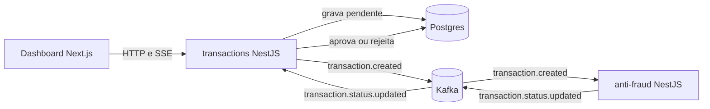

# Transações com antifraude assíncrono

Uma API de transações financeiras em NestJS que grava cada transação como pendente, publica
um evento no Kafka, recebe o veredito de um microsserviço antifraude e atualiza o status; um
dashboard em Next.js que lista, filtra, cria e acompanha a mudança de status sem recarregar a
tela. Monorepo pnpm com dois serviços, um dashboard e dois pacotes compartilhados.

As decisões de arquitetura, com as alternativas consideradas e a resposta sobre volume alto de
escritas e leituras, estão no [DECISIONS.md](./DECISIONS.md).

- [O que foi construído](#o-que-foi-construído)
- [Como rodar](#como-rodar)
- [Como testar](#como-testar)
- [Como usar a API](#como-usar-a-api)
- [Estrutura do repositório](#estrutura-do-repositório)
- [O que ficou de fora](#o-que-ficou-de-fora)

## O que foi construído



**`apps/transactions`**: `POST /transactions` valida o corpo, grava a transação como
`pending` e, depois do commit, publica `transaction.created` com a chave igual ao id externo.
Se o broker recusar, a resposta continua sendo `201` e um varredor republica o evento das
pendentes com mais de 10 segundos, a cada 5 segundos. O consumer de
`transaction.status.updated` aplica o veredito só a partir de `pending`, então um evento
duplicado não muda nada, e desiste da mensagem depois de três entregas para não prender a
partição enquanto o banco estiver fora: a transação segue pendente e o varredor recupera. `GET /transactions/:id` devolve uma transação, `GET /transactions`
lista com filtros, paginação e ordenação, e `GET /transactions/:id/events` é um stream
Server-Sent Events que entrega o status atual e cada mudança até o estado final.

**`apps/anti-fraud`**: consome `transaction.created`, aplica a regra (valor acima de 1000
rejeita, 1000 exato aprova) por uma função pura e publica `transaction.status.updated`.
Eventos fora do contrato são descartados com log; falha de infraestrutura é reentregue até
três vezes e depois abandonada, pelo mesmo motivo. `GET /health` responde pela conexão real com o Kafka.

**`apps/web`**: listagem paginada com filtros por status, tipo, período e ordenação, que
reconsulta a página enquanto houver transação pendente nela e para quando não houver;
detalhe
que assina o stream SSE enquanto a transação está pendente e mostra o veredito assim que
chega; formulário de criação validado com as mesmas regras do serviço, com um gerador de UUID
em cada campo de conta. Carregando, erro e vazio são componentes explícitos, alcançáveis por
papel acessível, e é por papel que os testes consultam a tela.

**`packages/contracts`**: tipos do contrato HTTP, nomes dos tópicos, envelope versionado dos
eventos e o schema `zod` que valida o que chega do Kafka. **`packages/messaging`**: porta de
publicação, interface fluente (`dispatch(publisher).event(t).keyedBy(k).with(d).publish()`),
adapter KafkaJS com falha rápida, publisher em memória para testes e a criação dos tópicos
no boot de cada serviço.

Medido na máquina local: o veredito fica visível entre 10 e 40 ms depois do `POST`; com o
broker fora do ar, o `POST` responde em cerca de 300 ms.

## Como rodar

Pré-requisitos: Node 22 (`.nvmrc`), pnpm 10 ou superior e Docker.

```bash
cp .env.example .env
docker compose up -d
pnpm install
pnpm db:migrate
```

Isso sobe Postgres, Kafka e Kafka UI, instala as dependências, gera o cliente Prisma e aplica
as migrations (que também semeiam os tipos de transferência: 1 transferência, 2 pagamento,
3 saque). Os tópicos do Kafka são criados pelos serviços ao subir.

Depois, em três terminais:

```bash
pnpm --filter @tech-challenge/transactions start:dev   # http://localhost:3001
pnpm --filter @tech-challenge/anti-fraud start:dev     # http://localhost:3002/health
pnpm --filter @tech-challenge/web dev                  # http://localhost:3000
```

As portas vêm do `.env`; nenhum serviço tem host ou porta em código. O Kafka UI fica em
http://localhost:8080 para inspecionar os tópicos.

## Como testar

```bash
pnpm quality        # lint, typecheck, format:check, test e build, na ordem; é o que o CI roda
pnpm test           # só os testes: 112 no total
```

Os testes de ponta a ponta dos serviços usam o Postgres e o Kafka do `docker compose`, lendo
o mesmo `.env`; a infra precisa estar de pé. Os testes unitários e os do dashboard não
dependem de nada externo.

```bash
pnpm --filter @tech-challenge/transactions test:unit                        # sem infra
pnpm --filter @tech-challenge/transactions exec jest --selectProjects e2e   # com infra
pnpm --filter @tech-challenge/web test
pnpm --filter @tech-challenge/anti-fraud exec jest -t "1000"                # por nome
```

O que cada suíte cobre:

- **transactions** (61): entidade e transição de status; criação com publicação após o
  commit e com o broker recusando; varredor de pendentes; consumer de status idempotente e
  veredito órfão; listagem com filtros, ordenação e paginação; SSE até o estado final;
  filtro de erros de negócio, com o teto de reentregas; health.
- **anti-fraud** (20): regra na fronteira (999.99, 1000, 1000.01); consumer publicando o
  veredito com a chave certa; descarte de evento fora do contrato e teto de reentregas; health com o broker fora.
- **messaging** (19) e **contracts** (2): interface fluente, envelope, validação,
  orçamento de reentregas e publisher em memória.
- **web** (10): três estados da listagem e a tabela; validação, gerador de UUID e envio do
  formulário; detalhe reagindo ao SSE e 404; boundary de erro.

O CI (`.github/workflows/quality.yml`) sobe Postgres e Kafka de verdade e roda exatamente
`pnpm quality`.

## Como usar a API

```bash
# criar (nasce pendente; o veredito chega pelo Kafka em milissegundos)
curl -s -X POST http://localhost:3001/transactions \
  -H 'content-type: application/json' \
  -d '{"accountExternalIdDebit":"9b2f1c3e-5a4d-4e6f-8a7b-1c2d3e4f5a6b","accountExternalIdCredit":"1a2b3c4d-5e6f-4a7b-8c9d-0e1f2a3b4c5d","transferTypeId":1,"value":120}'

# consultar
curl -s http://localhost:3001/transactions/<transactionExternalId>

# listar: status, transferTypeId, from, to (ISO-8601), page, pageSize (máximo 100), sort (createdAt ou value), sortDir
curl -s 'http://localhost:3001/transactions?status=approved&pageSize=5&sort=value&sortDir=desc'

# acompanhar o status até o estado final
curl -N http://localhost:3001/transactions/<transactionExternalId>/events
```

Respostas de erro: `400` para corpo ou filtro fora do formato, `404` para id desconhecido,
`422` para regra de negócio (tipo de transferência inexistente), `503` quando uma
dependência está indisponível.

## Estrutura do repositório

```
apps/
  transactions/   API e consumer de status; domain, application e infrastructure por módulo,
                  shared para o que é transversal (unidade de trabalho, erros, config, Prisma)
  anti-fraud/     consumer da regra; mesma organização
  web/            dashboard; features/transactions e shared, App Router
packages/
  contracts/      tipos, tópicos, envelope e schema dos eventos
  messaging/      porta de publicação, interface fluente, adapter Kafka e publisher em memória
.github/          workflow de CI e template de PR
```

Tudo entrou por PRs pequenas para `develop`, uma responsabilidade por branch, com o
`DECISIONS.md` crescendo na mesma PR em que a decisão foi tomada.

## O que ficou de fora

Cada item abaixo tem o porquê e o momento em que entraria no `DECISIONS.md`.

- **Outbox transacional e fila de mensagens envenenadas**: o varredor de pendentes cobre a
  falha de publicação com menos partes, e o teto de reentregas devolve a mensagem travada ao
  mesmo varredor; o outbox entra quando o volume pedir recuperação em milissegundos, e uma
  fila própria quando houver o que fazer com o evento abandonado além do log.
- **Descoberta de transação nova na listagem**: a listagem reconsulta enquanto houver
  pendente na página visível, então uma pendente à vista chega ao estado final sozinha, mas
  uma lista vazia continua vazia e quem está no filtro de aprovadas não vê uma aprovação
  chegar. Um stream da listagem cobriria isso e exige fan-out fora da memória do processo
  assim que houver mais de uma réplica.
- **Autenticação e autorização**: a API aceita qualquer origem e não há sessão no
  dashboard.
- **OpenAPI, Playwright, histórico de status, cache**: não fazem parte do problema neste
  recorte; a entrada "O recorte da vaga" no `DECISIONS.md` diz quando cada um valeria.
- **Empacotamento para produção**: não há Dockerfile dos serviços nem deploy; o
  `docker compose` cobre só a infraestrutura local.
